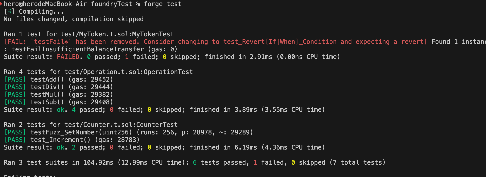
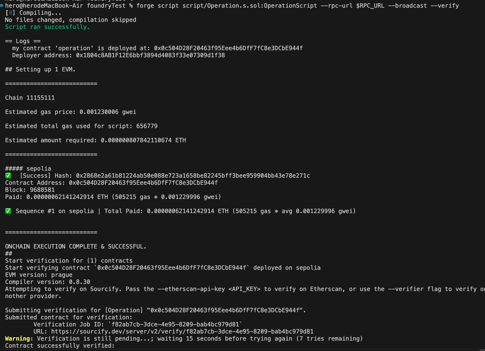
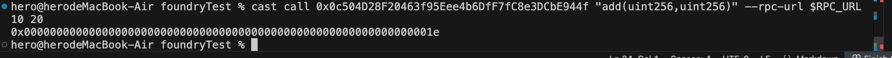
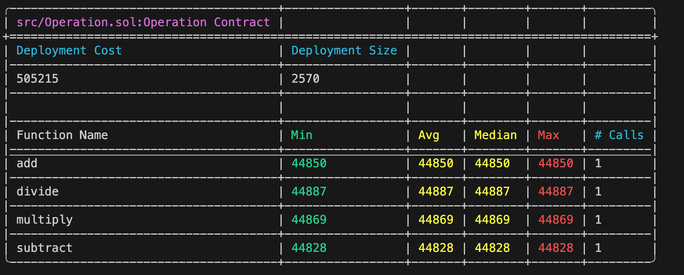

# Foundry 理论&实操

## 理论

Foundry​ 是由 Paradigm 主导开发的以太坊智能合约开发工具链，专为 Solidity 设计，以 纯 Solidity 开发、极速测试、本地化交互​ 为核心优势。其核心组件包括：  
Forge：编译、测试、部署合约的核心工具  
Cast：链上交互命令行工具  
Anvil：本地 EVM 节点模拟器  
Chisel：Solidity REPL 交互环境  

相较于传统框架（如 Hardhat/Truffle），Foundry 的独特优势在于：  
纯 Solidity 生态：测试、部署脚本均用 Solidity 编写，无需切换语言  
极速执行：Rust 编写的 EVM 模拟器，测试速度比 Hardhat 快 10-100 倍  
原生工具链：从编译到部署全链路集成，无需依赖 Node.js/JavaScript 生态  
高级调试：支持交易回放、堆栈追踪、Gas 消耗分析  

## 实践操作

1.**编写合约代码**

2.**编写部署脚本**

3.**编写测试脚本**

4.**部署合约到测试网(sepolia)**  
编译：orge build  
执行单元测试：forge test  
测试结果如下：  
  
执行部署：  
执行部署前需先导入RPC_URL和PRIVATE_KEY  
**export PRIVATE_KEY=your_private_key_here**  
**export PRIVATE_KEY=your_rpc_url_here**  

forge script script/Operation.s.sol:OperationScript --rpc-url $RPC_URL --broadcast --verify  
部署截图如下：  
合约地址：0x0c504D28F20463f95Eee4b6DfF7fC8e3DCbE944f  
  

5.**与合约交互(调用合约函数)**  

//如果函数没有参数，则调用方式如下：  
cast call 0x0c504D28F20463f95Eee4b6DfF7fC8e3DCbE944f "add()" --rpc-url $RPC_URL  

//如果函数有参数，则调用方式如下：  
cast call 0x0c504D28F20463f95Eee4b6DfF7fC8e3DCbE944f "add(uint256,uint256)" --rpc-url $RPC_URL 10 20  
测试结果如下：  
  

6.**检查合约函数的gas消耗情况**  
forge test --gas-report  
  
