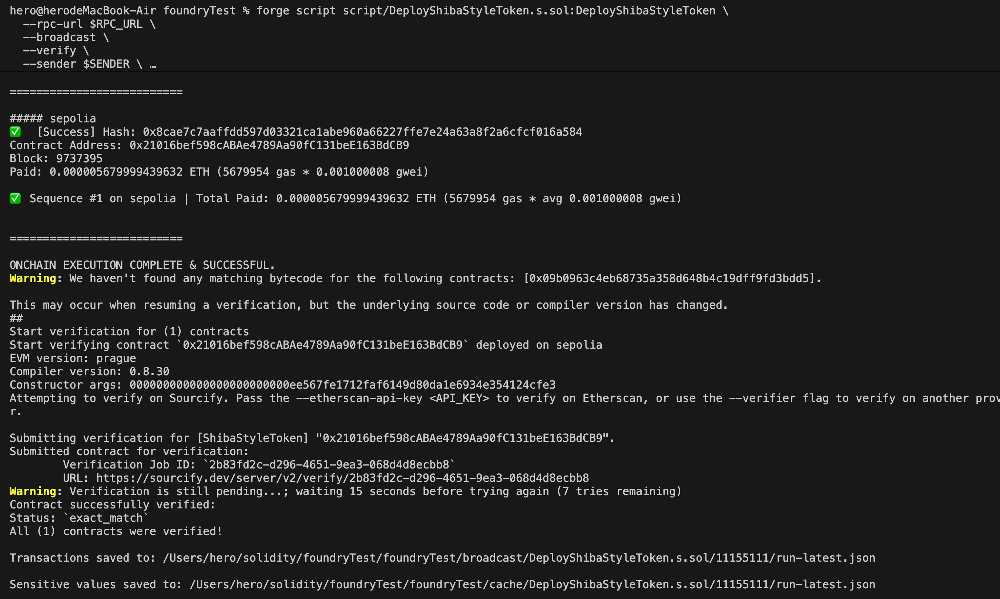

# 部署&测试流程

1. 安装依赖 openzeppelin
forge install openzeppelin/openzeppelin-contracts

2. 编译合约
forge build

3. 测试合约
forge test

4. 部署合约
执行部署前需先导入RPC_URL和PRIVATE_KEY  
**export PRIVATE_KEY=your_private_key_here**  
**export RPC_URL=your_rpc_url_here**  

forge script script/DeployShibaStyleToken.s.sol:DeployShibaStyleToken \
  --rpc-url $RPC_URL \
  --broadcast \
  --verify \
  --sender $SENDER \
  --private-key $PRIVATE_KEY  

部署截图如下：  
合约地址：0x21016bef598cABAe4789Aa90fC131beE163BdCB9  

